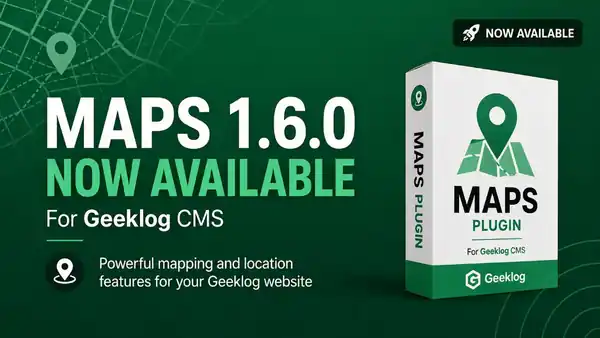

# Maps for Geeklog

Maps is a Geeklog plugin for creating Google Maps, markers, overlays, profile maps, Calendar event maps and map autotags.

## Maps 1.6.0 compatibility target

- Geeklog 2.1.1 through 2.2.2
- PHP 5.6 through 8.3
- MySQL/MariaDB versions supported by the corresponding Geeklog release
- Google Maps Platform as available in 2026

PHP syntax is checked on PHP 5.6, 7.4, 8.1 and 8.3 with GitHub Actions. The install compatibility gate accepts PHP 5.6 through 8.3 and Geeklog 2.1.1 through 2.2.2.

## Modernization roadmap

The current stabilization, UI/UX, security, testing and release plan is maintained in [ROADMAP.md](ROADMAP.md).

The roadmap is the reference for deciding what belongs in the 1.5.x stabilization line and what should be deferred to a future 2.0 architecture.

## Google Maps Platform setup

Create a Google Cloud project and enable billing for Google Maps Platform. Enable at least:

- Maps JavaScript API
- Geocoding API when address-to-coordinate conversion is used

In Geeklog's Maps configuration set:

- **Google Maps browser API key**: used by maps displayed in the browser. Restrict this key with HTTP referrers for your site domains.
- **Google Geocoding server API key**: optional but recommended for server-side geocoding. Apply server-appropriate restrictions. If empty, Maps falls back to the browser API key for compatibility with older installations.
- **Google Map ID**: optional in Maps 1.5 and reserved for migration toward Advanced Markers.
- **Google Maps language** and **region**: optional Google Maps localization hints.

Maps 1.6 no longer uses the retired `sensor` parameter or the removed Google Maps AdSense library.

## Markers and clustering

Maps 1.6 keeps `google.maps.Marker` for compatibility with existing maps and custom icons. Google has deprecated that class, so the `google_map_id` setting prepares a future migration to Advanced Markers without forcing it into this compatibility release.

The obsolete bundled MarkerClusterer 1.0.1 has been removed. Maps 1.6 uses the pinned UMD build of `@googlemaps/markerclusterer` 2.6.2.

Colored markers no longer depend on the retired Google Image Charts service. They are generated as SVG data URIs. Uploaded marker icons continue to use the plugin's shared image directory.

## Shared image resources and multisite

Map image resources intentionally remain shared across Geeklog sites:

- `images/maps/icons/`
- `images/maps/overlays/`

This behavior is suitable for both mono-site and multisite installations when the Geeklog images directory is shared.

## Removed legacy dependencies

Maps 1.6 removes:

- TimThumb
- FCKeditor-specific integration
- Google Maps AdSense integration
- Google Maps v2 direction error constants
- Google Image Charts marker URLs
- installation/upgrade telemetry email
- PHP `preg_replace(... /e ...)` usage

## Upgrade

The supported modernization path is to reach Maps 1.4.0 first, then run Geeklog's normal plugin upgrade to Maps 1.6.0. The 1.6.0 upgrader applies the complete 1.5.x/1.6.0 configuration and public-folder migrations in sequence, including repairs introduced in 1.5.1 through 1.5.8.

Older Maps installations should therefore be upgraded to 1.4.0 before installing the 1.5.8 files. Back up the database and the shared `images/maps/` directory before upgrading a production site.

After copying or uploading the 1.5.8 package, run the normal Geeklog plugin upgrade from the Plugin Administration screen before opening the Maps administration page.

## Autotags

The historical autotags remain available:

- `[maps: ...]`
- `[geo: ...]`
- `[marker: ...]`

## Development

Bug reports and feature requests belong in the Geeklog Maps repository issue tracker. Changes should be tested against the supported Geeklog/PHP matrix before release.